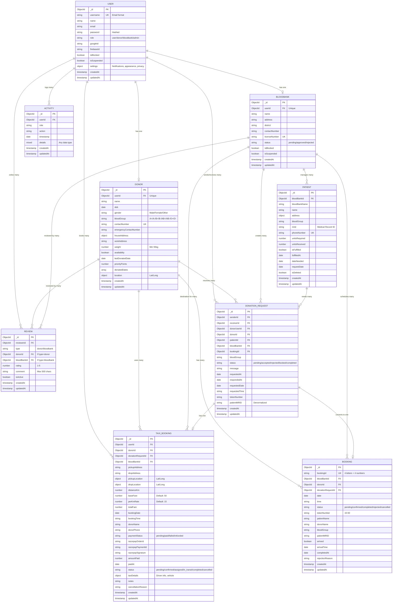

# 🎨 Blood Donation System - Entity Relationship Diagram

## Visual ER Diagram (Mermaid Format)



## Detailed Relationship Descriptions

### 1. User ↔ Donor (One-to-One)
- **Cardinality:** 1:0..1
- **Foreign Key:** `Donor.userId` → `User._id`
- **Constraint:** Unique index on `Donor.userId`
- **Description:** A user with role "donor" can have exactly one donor profile

### 2. User ↔ BloodBank (One-to-One)
- **Cardinality:** 1:0..1
- **Foreign Key:** `BloodBank.userId` → `User._id`
- **Constraint:** Unique index on `BloodBank.userId`
- **Description:** A user with role "bloodbank" can have exactly one blood bank profile

### 3. User ↔ Review (One-to-Many)
- **Cardinality:** 1:0..*
- **Foreign Key:** `Review.reviewerId` → `User._id`
- **Description:** A user can write multiple reviews

### 4. User ↔ Activity (One-to-Many)
- **Cardinality:** 1:0..*
- **Foreign Key:** `Activity.userId` → `User._id`
- **Description:** All user actions are logged

### 5. User ↔ DonationRequest (Many-to-Many)
- **Cardinality:** *:*
- **Foreign Keys:** 
  - `DonationRequest.senderId` → `User._id`
  - `DonationRequest.receiverId` → `User._id`
  - `DonationRequest.donorUserId` → `User._id`
  - `DonationRequest.requesterId` → `User._id`
- **Description:** Users can send and receive multiple donation requests

### 6. Donor ↔ DonationRequest (One-to-Many)
- **Cardinality:** 1:0..*
- **Foreign Key:** `DonationRequest.donorId` → `Donor._id`
- **Description:** A donor can receive multiple donation requests

### 7. Donor ↔ Booking (One-to-Many)
- **Cardinality:** 1:0..*
- **Foreign Key:** `Booking.donorId` → `Donor._id`
- **Description:** A donor can have multiple bookings

### 8. Donor ↔ Review (One-to-Many)
- **Cardinality:** 1:0..*
- **Foreign Key:** `Review.donorId` → `Donor._id`
- **Constraint:** Compound unique index prevents duplicate reviews
- **Description:** A donor can be reviewed by multiple users

### 9. BloodBank ↔ Patient (One-to-Many)
- **Cardinality:** 1:0..*
- **Foreign Key:** `Patient.bloodBankId` → `BloodBank._id`
- **Description:** A blood bank manages multiple patients

### 10. BloodBank ↔ DonationRequest (One-to-Many)
- **Cardinality:** 1:0..*
- **Foreign Key:** `DonationRequest.bloodBankId` → `BloodBank._id`
- **Description:** A blood bank can create multiple donation requests

### 11. BloodBank ↔ Booking (One-to-Many)
- **Cardinality:** 1:0..*
- **Foreign Key:** `Booking.bloodBankId` → `BloodBank._id`
- **Description:** A blood bank schedules multiple donation bookings

### 12. BloodBank ↔ Review (One-to-Many)
- **Cardinality:** 1:0..*
- **Foreign Key:** `Review.bloodBankId` → `BloodBank._id`
- **Constraint:** Compound unique index prevents duplicate reviews
- **Description:** A blood bank can be reviewed by multiple users

### 13. Patient ↔ DonationRequest (One-to-Many)
- **Cardinality:** 1:0..*
- **Foreign Key:** `DonationRequest.patientId` → `Patient._id`
- **Description:** A patient can have multiple donation requests

### 14. DonationRequest ↔ Booking (One-to-One)
- **Cardinality:** 1:0..1
- **Foreign Key:** `Booking.donationRequestId` → `DonationRequest._id`
- **Reverse Reference:** `DonationRequest.bookingId` → `Booking._id`
- **Description:** An accepted donation request can be converted to one booking

### 15. DonationRequest ↔ TaxiBooking (One-to-One)
- **Cardinality:** 1:0..1
- **Foreign Key:** `TaxiBooking.donationRequestId` → `DonationRequest._id`
- **Description:** A donation request can have one associated taxi booking

---

## Database Flow Diagrams

### Blood Donation Request Flow

```
┌─────────────┐
│   Patient   │ (Blood Bank creates patient record)
└──────┬──────┘
       │
       ↓
┌─────────────────────┐
│ DonationRequest     │ (Blood Bank creates request to donor)
│ Status: pending     │
└──────┬──────────────┘
       │
       ↓
┌─────────────────────┐
│ Donor Responds      │
│ Accept / Reject     │
└──────┬──────────────┘
       │
       ↓ (if accepted)
┌─────────────────────┐
│ DonationRequest     │
│ Status: accepted    │
│ → pending_booking   │
└──────┬──────────────┘
       │
       ↓
┌─────────────────────┐
│     Booking         │ (Donor books a slot)
│ Status: pending     │
└──────┬──────────────┘
       │
       ↓ (optional)
┌─────────────────────┐
│   TaxiBooking       │ (Donor books taxi)
│ Payment via Razorpay│
└──────┬──────────────┘
       │
       ↓
┌─────────────────────┐
│     Booking         │ (Blood bank confirms)
│ Status: confirmed   │
│ Token: 15-50        │
└──────┬──────────────┘
       │
       ↓
┌─────────────────────┐
│ Donor Arrives       │ (Front desk marks arrival)
│ arrived: true       │
└──────┬──────────────┘
       │
       ↓
┌─────────────────────┐
│     Booking         │ (Donation completed)
│ Status: completed   │
└──────┬──────────────┘
       │
       ↓
┌─────────────────────┐
│   Patient Update    │ (Units received++)
│ unitsReceived++     │
│ isFulfilled: true   │
└─────────────────────┘
       │
       ↓
┌─────────────────────┐
│      Review         │ (User reviews donor/blood bank)
│   Rating: 1-5       │
└─────────────────────┘
```

### User Registration & Authentication Flow

```
┌─────────────────────┐
│  User Registers     │
│  (username, pass,   │
│   role)             │
└──────┬──────────────┘
       │
       ↓
┌─────────────────────┐
│   User Record       │ (Password hashed with bcrypt)
│   Created           │
└──────┬──────────────┘
       │
       ├─→ (if role = donor)
       │   ┌─────────────────┐
       │   │ Donor Profile   │
       │   │ Registration    │
       │   └─────────────────┘
       │
       └─→ (if role = bloodbank)
           ┌─────────────────┐
           │ Blood Bank      │
           │ Registration    │
           │ Status: pending │
           └──────┬──────────┘
                  │
                  ↓
           ┌─────────────────┐
           │ Admin Approval  │
           │ Status: approved│
           └─────────────────┘
```

### Review System Flow

```
┌─────────────────────┐
│ User completes      │
│ donation/booking    │
└──────┬──────────────┘
       │
       ↓
┌─────────────────────┐
│ User eligible to    │
│ review              │
└──────┬──────────────┘
       │
       ├─→ Review Donor
       │   ┌─────────────────┐
       │   │ Review          │
       │   │ type: donor     │
       │   │ rating: 1-5     │
       │   │ comment         │
       │   └─────────────────┘
       │
       └─→ Review Blood Bank
           ┌─────────────────┐
           │ Review          │
           │ type: bloodbank │
           │ rating: 1-5     │
           │ comment         │
           └─────────────────┘
```

### Taxi Booking & Payment Flow

```
┌─────────────────────┐
│ DonationRequest     │
│ Status: accepted    │
└──────┬──────────────┘
       │
       ↓
┌─────────────────────┐
│ User books taxi     │
│ (pickup, drop,      │
│  distance)          │
└──────┬──────────────┘
       │
       ↓
┌─────────────────────┐
│ Calculate Fare      │
│ ₹50 + (km × ₹15)    │
└──────┬──────────────┘
       │
       ↓
┌─────────────────────┐
│ Create Razorpay     │
│ Order               │
└──────┬──────────────┘
       │
       ↓
┌─────────────────────┐
│ TaxiBooking         │
│ paymentStatus:      │
│ pending             │
└──────┬──────────────┘
       │
       ↓
┌─────────────────────┐
│ User Pays           │
│ (Razorpay)          │
└──────┬──────────────┘
       │
       ↓
┌─────────────────────┐
│ TaxiBooking         │
│ paymentStatus: paid │
│ status: confirmed   │
└──────┬──────────────┘
       │
       ↓
┌─────────────────────┐
│ Driver Assigned     │
│ status: assigned    │
└──────┬──────────────┘
       │
       ↓
┌─────────────────────┐
│ In Transit          │
│ status: in_transit  │
└──────┬──────────────┘
       │
       ↓
┌─────────────────────┐
│ Completed           │
│ status: completed   │
└─────────────────────┘
```

---

## Cardinality Notation

- `||` : Exactly one
- `|o` : Zero or one
- `}o` : Zero or many
- `}|` : One or many

---

## Key Constraints Summary

| Collection | Unique Constraints | Foreign Keys |
|---|---|---|
| User | username, phone, googleId, firebaseId | - |
| Donor | userId, contactNumber | userId → User._id |
| BloodBank | userId, licenseNumber | userId → User._id |
| Patient | phoneNumber | bloodBankId → BloodBank._id |
| DonationRequest | - | donorId, patientId, bloodBankId, bookingId |
| Booking | bookingId | donorId, bloodBankId, donationRequestId |
| Review | (reviewerId, type, donorId, bloodBankId) | reviewerId, donorId, bloodBankId |
| TaxiBooking | - | userId, donorId, donationRequestId, bloodBankId |
| Activity | - | userId → User._id |

---

## Data Integrity Rules

### Referential Integrity
1. **Cascade on Delete:** Not implemented (soft deletes used instead)
2. **Orphaned Records:** Prevented by application logic
3. **Foreign Key Validation:** Enforced by Mongoose `ref` and application layer

### Data Consistency
1. **Unique Constraints:** Enforced at database level
2. **Enum Validation:** Enforced by Mongoose schema
3. **Required Fields:** Enforced by Mongoose schema
4. **Custom Validation:** Implemented in schema validators

### Transaction Support
1. **MongoDB Transactions:** Available for multi-document operations
2. **Atomic Operations:** Used for single-document updates
3. **Session Support:** Can be used for complex workflows

---

**Document Version:** 1.0  
**Last Updated:** October 24, 2025  
**Diagram Tool:** Mermaid (compatible with GitHub, GitLab, Notion, etc.)

